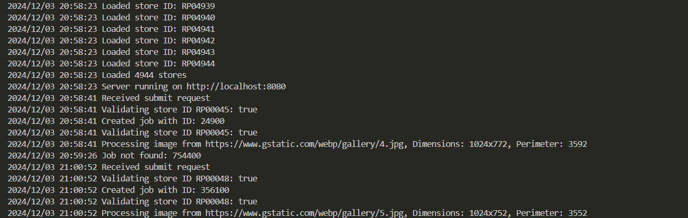

# Store Image Processing Service

## Description
A microservice for processing store images, validating store IDs, and generating job results with image metadata.

## Assumptions
- Store data loaded from CSV file
- Images can be downloaded via URLs
- Job processing occurs asynchronously
- Random sleep simulates GPU processing

## Prerequisites
- Go 1.22+
- Docker 3+
- Docker Compose 3+

## Installation

### Local Setup
1. Clone repository
2. Install dependencies:
    ```bash
    go mod download
    ```
3. Run application:
    ```bash
    go run .
    ```

### Docker Setup
1. Ensure Docker and Docker Compose are installed
2. Run
    ```bash
    docker-compose up --build
    ```
### API Endpoints

1. POST /api/submit/: Submit job with store visits
2. GET /api/status?jobid=<ID>: Check job status

### Work Environment

1. OS: Windows 11
2. IDE: Visual Studio Code
3. Language: Go 1.22.4
4. Libraries:
    1. github.com/gorilla/mux
    2. encoding/json
    3. net/http
    4. strconv
    5. time
    6. log
    7. fmt
    8. os
    9. sync
    10. image
    11. math/rand
    12. net/url
    
### Future Improvements

1. Enhanced error handling
2. Comprehensive and structured logging
3. Add Makefile for common tasks
4. Create CI/CD pipeline (GitHub Actions)
5. Implement comprehensive unit/integration tests
6. Persistent job storage
7. Rate limiting
8. Advanced image validation
9. Metrics and monitoring


### To run the project with docker:

1. Ensure Docker and Docker Compose are installed
2. Navigate to project directory
3. Run :
    ```bash
    docker-compose up --build
    ```
    #### This will:

    1. Build the Docker image
    2. Start the service
    3. Map port 8080
    4. Mount data volume

    #### Test endpoints using:

    1. Postman
    2. cURL
    3. Provided test scripts

## Results


